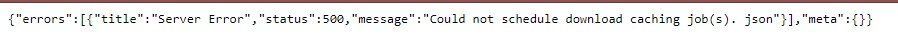

<br>

# Introduction

This code-through will show how to take open data addresses and turn them into an interactive map using the **[Leaflet](https://cran.r-project.org/web/packages/leaflet/index.html)** package. I will take addresses from the Phoenix Public Library system and plot these on a map, with markers that provide additional useful information about the libraries. The goal is to have a single page where people can go to find which library would be most useful to their needs. This map could also be embedded on the public library website to inform patrons. 

## Concept

This project built on information in a [**Towards Data Science**](https://towardsdatascience.com/making-interactive-maps-in-r-with-less-than-15-lines-of-code-bfd81f587e12) Medium post by Brandon Walker. 

## Data

These maps were built using data from the [**Phoenix, AZ Open Data Portal**](https://www.phoenixopendata.com/dataset/libraries/resource/b7158429-b69e-4f87-8a96-b4857c6d65b5). The data was not linked through the API (since it was broken at the time of creation) so the data is static as of 10/1/2020.

Ouch[](https://miro.medium.com/max/1600/1*ASPrAbd2qtFVSVuru7Y7Rw.png)

```{r include = FALSE}

# LOAD REQUIRED PACKAGES

#install.packages("htmlwidgets")
#install.packages("magrittr")
#install.packages("DT")
#install.packages("AwesomeMarkers")

#library(ggmap)        # Packages per instructions
library(dplyr)
library(leaflet)      #Leaflet makes that map work, baby.
library(ggplot2)
library(gsheet)
library(tidyverse)
library(htmlwidgets)
library(magrittr)
#library(awesomemarkers)
library("DT")

```

```{r include = FALSE}

# READ IN DATA

url <- ("https://docs.google.com/spreadsheets/d/1PU2258E1tMJdTH2dbtQ6uR7OSEAcG_WegHFfGAbCDfw/edit?usp=sharing")
a <- gsheet2text(url, format='csv')
libraries <- read.csv(text=a, stringsAsFactors=FALSE)

```

<br>

The data provides us with a series of (semi-useful) headings:

```{r echo = TRUE}

ls(libraries)
```

```{r}
head(libraries, n=5)
```
The basic command to start a map in `Leaflet` simply requires you to `addTiles()` and then call the map:

```{r}
m <- leaflet(libraries) %>%
  addTiles()   # Add default OpenStreetMap map tiles
  
m  # Print the map
```

But first we need to fix our data...

<br>

# Preprocessing

We have two sets (4) of columns that correspond with longitude and latitude. I'm going to change those names to `lng` and `lat` to make it easier for **[Leaflet](https://cran.r-project.org/web/packages/leaflet/index.html)** to read. This isn't necessary but I thought it would be easier since we have another pair of columns that have the `X/Y` values as a backup if we needed that naming convention.

```{r}
libraries <- libraries %>%
  rename(lng = DegreesX) %>%
  rename(lat = DegreesY)
```


The data from this portal is fairly minimal and requires very little preprosessing. For **[Leaflet](https://cran.r-project.org/web/packages/leaflet/index.html)** to work properly, we need more than just the address of the library - which is provided in the dataframe under `libraries$AddressFull`.

## Adding the Lon/Lat Coordinates

```{r}

```
<br>

## Geocoding with GGMAP

We have a series of addresses and X/Y coordinates that correspond with longitude and latitude. However, if you did not have lon/lat coordinates, you can load [ggmap](https://cran.r-project.org/web/packages/ggmap/index.html) package and call the `geocode()` function to the addresses.

For example, if I wanted to find a central location in Phoenix, AZ as the center of my map (we'll adjust the zoom later). I can chose the [Burton Barr Library](https://www.phoenixpubliclibrary.org/Locations/BurtonBarr) and pass the address through `geocode()` like this:

```{r}
#geocode("1221 N. Central Ave, Phoenix, ArZ 85004")
```
<br>

# Creating and Customizing Our Map

The purpose of this map is to show where all of the libraries are located, so we want to add markers. You can add basic blue markers by calling `addMarkers()` in Leaflet and then adding the lng/lat coordinates. You can also pass it through a dataframe if you have a list of coordinates. Calling `addMarkers()` will add markers for your points of interest.

```{r}
libmap <- leaflet() %>%
  addTiles() %>%
  addMarkers(lng = libraries$lng, lat = libraries$lat)

libmap
```

## Changing the Map Tiles

There are a huge number free, beautiful "tiles" (customized maps) that you can add to your interface - either as your base or on top of existing tiles.  You can see examples on this [equally beautiful GitHub page.](http://leaflet-extras.github.io/leaflet-providers/preview/index.html). I chose the `OpenStreetMap.HOT` interface because it felt a little more subtle and emphasized traffic markings less.

```{r}
libmap <- leaflet() %>%
  addProviderTiles(providers$OpenStreetMap.HOT) %>%
  addMarkers(lng = libraries$lng, lat = libraries$lat)

libmap
```


## Adding Markers for the Libraries

I didn't like how the large blue markers obscured data on the map so I made them into flat circles.  I changed the open libraries to a green circle and I also added a circle that is red for the `South Mountain Community Library` because it is **CLOSED**.

```{r}
libmap <- leaflet() %>%
  addProviderTiles(providers$OpenStreetMap.HOT) %>%
  addCircleMarkers(
    lng = libraries$lng, lat = libraries$lat, 
    radius = 6,
    color = "green",
    stroke = FALSE, fillOpacity = 0.5) %>%
  addCircleMarkers(
    lng = -112.0312464, lat = 33.38217769,
    radius = 6,
    color = "red",
    stroke = FALSE, fillOpacity = 0.6
  )
  
libmap
```

<br>

## Adding Labels with Information

I would also like for the user to see the name of the library when they hover over the circles. Doing this only requires adding the `label = libraries$PlaceName` argument to the markers.  

```{r}
libmap <- leaflet() %>%
  addProviderTiles(providers$OpenStreetMap.HOT) %>%
  addCircleMarkers(
    lng = libraries$lng, lat = libraries$lat, 
    label = libraries$PlaceName,
    radius = 6,
    color = "green",
    stroke = FALSE, fillOpacity = 0.5) %>%
  addCircleMarkers(
    lng = -112.0312464, lat = 33.38217769, 
    label = libraries$PlaceName,
    radius = 6,
    color = "red",
    stroke = FALSE, fillOpacity = 0.5
  )
  
libmap
```


<br>

## Clicking Popup Information

To make our map more useful, we'd like some basic information to popup when the user clicks on a marker.  I've chosen the library's website because I feel like that would lead the user to discovering all of the information that they need (from books to lending policies). This information is provided in the dataset so we can link to it using `popup = libraries$PlaceWeb`. This gets a little cluttered and so I might customize the boxes more in the future. 

```{r}
libmap <- leaflet() %>%
  addProviderTiles(providers$OpenStreetMap.HOT) %>%
  addCircleMarkers(
    lng = libraries$lng, lat = libraries$lat, 
    label = libraries$PlaceName,
    popup = libraries$PlaceWeb,
    radius = 6,
    color = "green",
    stroke = FALSE, fillOpacity = 0.5) %>%
  addCircleMarkers(
    lng = -112.0312464, lat = 33.38217769, 
    label = libraries$PlaceName,
    popup = libraries$PlaceWeb,
    radius = 6,
    color = "red",
    stroke = FALSE, fillOpacity = 0.5
  )
  
libmap
```

# Final Product

```{r eval=FALSE, include=FALSE}
libmap %>%
  leaflet() %>%
addProviderTiles(providers$Esri.WorldImagery, group = "World Imagery") %>%
addProviderTiles(providers$Stamen.TonerLite, group = "Toner Lite") %>%
addLayersControl(baseGroups = c("Toner Lite", "World Imagery")) %>%
addMarkers(label = ibraries$PlaceName,
           popup = libraries$PlaceWeb) %>%
setView(lat = 33.462314, lng = -112.072916, zoom = 11) %>%
addMiniMap(
    toggleDisplay = TRUE,
    tiles = providers$Stamen.TonerLite
    )
```

